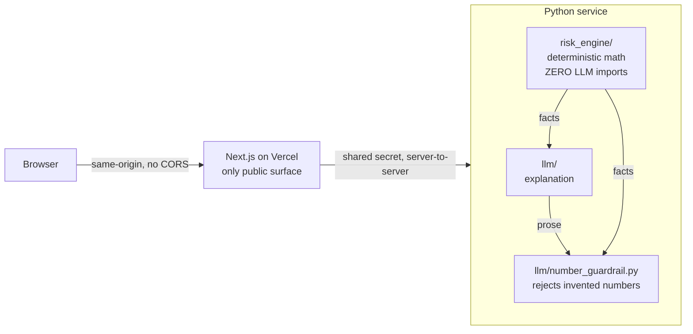

# RiskPilot AI

**A full-stack app where deterministic risk math is computed in Python, and an LLM
only _explains_ it — with a guardrail that rejects any number the model invents.**

🔗 **Live demo:** _(deploy in M1 — link goes here)_ · runs with **no signup, no API key**
📊 **Reliability:** _0 hallucinated numbers in final output across N eval cases_ — see [`docs/RELIABILITY.md`](docs/RELIABILITY.md)
🛡️ **Compliance:** educational risk coaching, never buy/sell advice — see [`COMPLIANCE.md`](COMPLIANCE.md)

<!-- M2: drop a demo GIF here, above the fold. -->

## The idea in one diagram



The whole thesis: **the LLM may only explain numbers `risk_engine` computed.** An
import-lint test proves `risk_engine` never touches the LLM; the guardrail proves the
LLM never ships a number the engine didn't produce.

## Run it (no OpenAI key needed)

```bash
git clone <repo> && cd "RiskPilot AI"
cp .env.example .env       # defaults run in DEMO_MODE — no key required
make doctor                # checks versions + env, prints fixes
make install               # backend venv + frontend deps
make dev                   # backend :8000 + frontend :3000
```

Open http://localhost:3000 — the sample portfolio's risk X-Ray renders with a
grounded explanation, no key. Set `OPENAI_API_KEY` + `DEMO_MODE=0` to use the live model.

## Where to look (30-second repo tour)

| Path | What |
|------|------|
| [`backend/src/riskpilot/llm/number_guardrail.py`](backend/src/riskpilot/llm/number_guardrail.py) | **The headline artifact** — rejects hallucinated numbers in LLM prose |
| [`backend/tests/test_number_guardrail.py`](backend/tests/test_number_guardrail.py) | The guardrail's proof — test names narrate the safety story |
| [`backend/src/riskpilot/risk_engine/`](backend/src/riskpilot/risk_engine/) | Deterministic math. Zero LLM imports (enforced by a test) |
| [`backend/tests/test_no_llm_in_engine.py`](backend/tests/test_no_llm_in_engine.py) | Import-lint proving the math/LLM separation |
| [`frontend/src/app/page.tsx`](frontend/src/app/page.tsx) | The risk X-Ray dashboard |
| [`PLAN.md`](PLAN.md) | Full plan + the 4-phase review that shaped it |

## Repository map

```
backend/    FastAPI math+LLM service (private). risk_engine/ vs llm/ encodes the thesis.
frontend/   Next.js App Router (public). The only thing the browser talks to.
scripts/    make doctor preflight.
```

## Commands

```bash
make dev      # run both services (no key)
make test     # backend tests — runs green with NO key (fixtures)
make eval     # LLM-reliability eval — reproduces the README number
make doctor   # preflight checks
make build    # production frontend build
```

## Status

**M1 (this build): deployed skeleton.** Stack runs end-to-end in DEMO_MODE: real risk
X-Ray rendered from deterministic facts + a grounded template explanation, behind the
single-public-origin topology. The guardrail core + its tests are in place
(`is_grounded` is the one function left to implement — 5 RED tests describe its contract).

**M2 (next): the shippable artifact.** Real risk formulas over a committed historical
dataset, the live guardrailed OpenAI call, the eval number, the radial-gauge dashboard.

**Deferred (M3+):** FOMO journal coach, scenario simulator, RAG research assistant.

---

> Educational risk coaching, not financial advice. No buy/sell recommendations.
> Illustrative sample data only. See [`COMPLIANCE.md`](COMPLIANCE.md).
