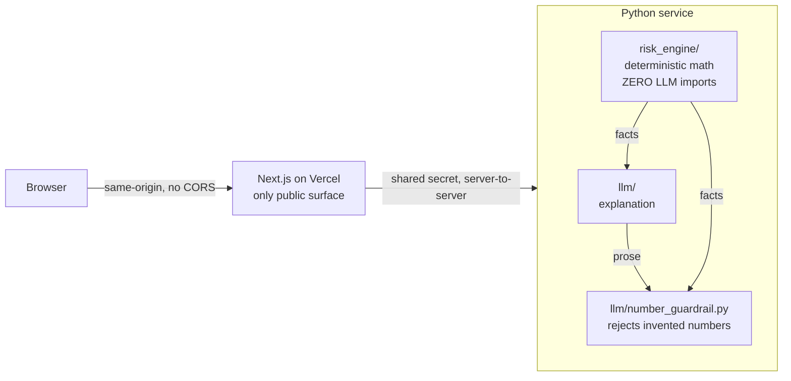

# RiskPilot AI

[](https://github.com/Kaydenletk/riskpilot-ai/actions/workflows/ci.yml)
[](LICENSE)
[](CONTRIBUTING.md)

**A full-stack app where deterministic risk math is computed in Python, and an LLM
only _explains_ it — with a guardrail that rejects any number the model invents.**

🔗 **Live demo:** [riskpilot-coach.vercel.app](https://riskpilot-coach.vercel.app) · runs with **no signup, no API key**
_(The dashboard renders from a committed snapshot of the real computed report. When the
private Python risk engine is hosted, the live frontend prefers it and the snapshot is the
fallback. Run locally for the full pipeline including the live guardrail.)_

📊 **Reliability:** guardrail caught **2/2 injected hallucinations** on the committed fixture set (4 cases) → **0 hallucinated numbers in final output** by fail-closed fallback. This is a small proof-of-wiring set, not a statistical claim yet — a larger live benchmark (recall, false-positive rate, latency, cost) is in progress. See [`docs/RELIABILITY.md`](docs/RELIABILITY.md)
🛡️ **Compliance:** educational risk coaching, never buy/sell advice — see [`COMPLIANCE.md`](COMPLIANCE.md)

<!-- M2: drop a demo GIF here, above the fold. -->

## The idea in one diagram



The whole thesis: **the LLM may only explain numbers `risk_engine` computed.** An
import-lint test proves `risk_engine` never touches the LLM; the guardrail proves the
LLM never ships a number the engine didn't produce.

## Run it (no OpenAI key needed)

```bash
git clone <repo> && cd "RiskPilot AI"
cp .env.example .env       # defaults run in DEMO_MODE — no key required
make doctor                # checks versions + env, prints fixes
make install               # backend venv + frontend deps
make dev                   # backend :8000 + frontend :3000
```

Open http://localhost:3000 — the sample portfolio's risk X-Ray renders with a
grounded explanation, no key. Set `OPENAI_API_KEY` + `DEMO_MODE=0` to use the live model.

## Where to look (30-second repo tour)

| Path | What |
|------|------|
| [`backend/src/riskpilot/llm/number_guardrail.py`](backend/src/riskpilot/llm/number_guardrail.py) | **The headline artifact** — rejects hallucinated numbers in LLM prose |
| [`backend/tests/test_number_guardrail.py`](backend/tests/test_number_guardrail.py) | The guardrail's proof — test names narrate the safety story |
| [`backend/src/riskpilot/risk_engine/`](backend/src/riskpilot/risk_engine/) | Deterministic math. Zero LLM imports (enforced by a test) |
| [`backend/tests/test_no_llm_in_engine.py`](backend/tests/test_no_llm_in_engine.py) | Import-lint proving the math/LLM separation |
| [`frontend/src/app/page.tsx`](frontend/src/app/page.tsx) | The risk X-Ray dashboard |
| [`PLAN.md`](PLAN.md) | Full plan + the 4-phase review that shaped it |

## Repository map

```
backend/    FastAPI math+LLM service (private). risk_engine/ vs llm/ encodes the thesis.
frontend/   Next.js App Router (public). The only thing the browser talks to.
scripts/    make doctor preflight.
```

## Commands

```bash
make dev      # run both services (no key)
make test     # backend tests — runs green with NO key (fixtures)
make eval     # LLM-reliability eval — reproduces the README number
make doctor   # preflight checks
make build    # production frontend build
```

## Status

**M1 (this build): deployed skeleton.** Stack runs end-to-end in DEMO_MODE: real risk
X-Ray rendered from deterministic facts + a grounded template explanation, behind the
single-public-origin topology. The guardrail core + its tests are in place
(`is_grounded` is the one function left to implement — 5 RED tests describe its contract).

**M2 (done): real risk math.** Every metric is computed from a committed,
reproducible dataset — covariance-based portfolio volatility, value-weighted
concentration, historical max drawdown, a documented concentration-led risk score.
23 hand-verified math/score tests. See [`DATA_SOURCE.md`](DATA_SOURCE.md).

**M2 (remaining): the live LLM call** wrapping the guardrail, and the radial-gauge
dashboard (currently a clean stub). **Deferred (M3+):** FOMO journal coach, scenario
simulator, RAG research assistant.

## Contributing

PRs welcome. RiskPilot keeps math deterministic and never gives investment advice —
those two constraints are enforced by tests, not just docs. Start with
[`CONTRIBUTING.md`](CONTRIBUTING.md): setup, the ground rules, and good first issues.

```bash
make test    # backend suite, runs with NO key
make eval    # LLM-reliability number, runs on fixtures
```

By participating you agree to the [Code of Conduct](CODE_OF_CONDUCT.md). Licensed
under [MIT](LICENSE).

---

> Educational risk coaching, not financial advice. No buy/sell recommendations.
> Illustrative sample data only. See [`COMPLIANCE.md`](COMPLIANCE.md).
